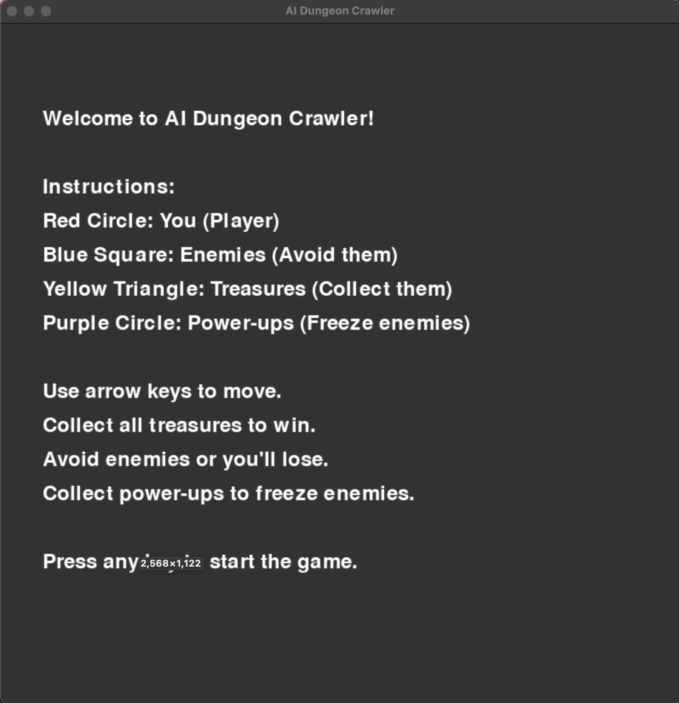
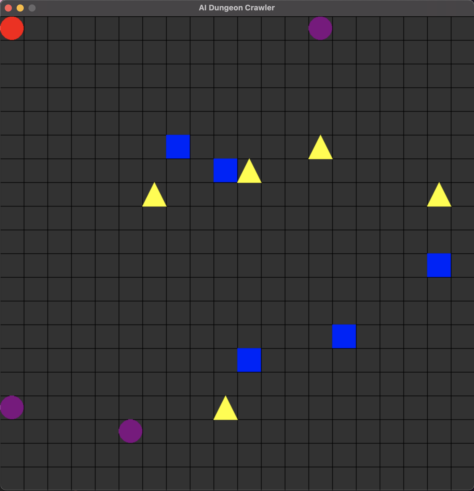
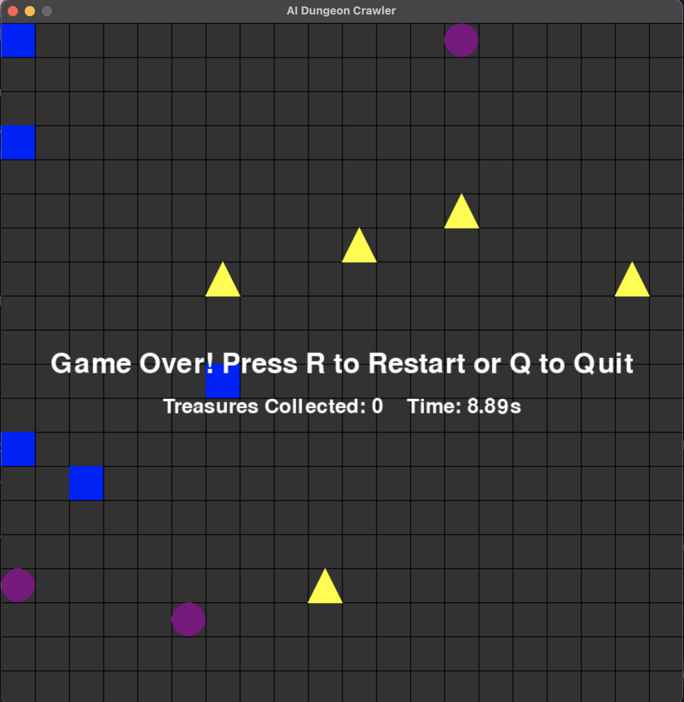

# AI Dungeon Crawler

Welcome to the AI Dungeon Crawler game! This is a simple maze game implemented using Python and Pygame where you navigate a grid, collect treasures, avoid enemies, and use power-ups to freeze enemies.

## Game Features

- **Player**: Represented by a red circle. Use the arrow keys to move around the grid.
- **Enemies**: Represented by blue squares. They chase the player.
- **Treasures**: Represented by yellow triangles. Collect them to win the game.
- **Power-ups**: Represented by purple circles. Collect them to temporarily freeze enemies.
- **Stats**: View the number of treasures collected and the time spent when the game ends.
- **Game Over**: If an enemy catches you, the game ends.
- **Win Condition**: Collect all treasures to win the game.

## How to Play

1. **Move the Player**: Use the arrow keys (Up, Down, Left, Right) to move the player.
2. **Collect Treasures**: Move over yellow triangles to collect them.
3. **Avoid Enemies**: Do not get caught by the blue squares.
4. **Use Power-ups**: Move over purple circles to freeze enemies temporarily.
5. **Game Over**: If caught by an enemy, the game ends. Press 'R' to restart or 'Q' to quit.
6. **Win**: Collect all treasures to win the game. Press 'R' to restart or 'Q' to quit.
7. **View Stats**: After the game ends, see the number of treasures collected and the total time spent.

## Installation

To run the AI Dungeon Crawler game, follow these steps:

1. **Clone the repository**:
   ```bash
   git clone https://github.com/tsmio/ai-dungeon-crawler
   ```
2. **Navigate to the project directory**:
   ```bash
   cd ai-dungeon-crawler
   ```
3. **Install dependencies**:
   Ensure you have Python and Pygame installed. If not, install them using pip:
   ```bash
   pip install pygame
   ```
4. **Run the game**:
   ```bash
   python ai_dungeon_crawler.py
   ```

## Game Instructions

When you start the game, you'll see an introductory screen with the following details:

- **Red Circle**: You (Player)
- **Blue Square**: Enemies (Avoid them)
- **Yellow Triangle**: Treasures (Collect them)
- **Purple Circle**: Power-ups (Freeze enemies)

Use the arrow keys to move. Collect all treasures to win. Avoid enemies or you'll lose. Collect power-ups to freeze enemies.

## Game Controls

- **Arrow Keys**: Move the player.
- **R**: Restart the game after it ends.
- **Q**: Quit the game after it ends.

## Screenshots





## Contributing

If you'd like to contribute to the project, please fork the repository and use a feature branch. Pull requests are welcome.

## License

This project is licensed under the MIT License.

## Acknowledgements

Special thanks to the Pygame community and all contributors to the project.
